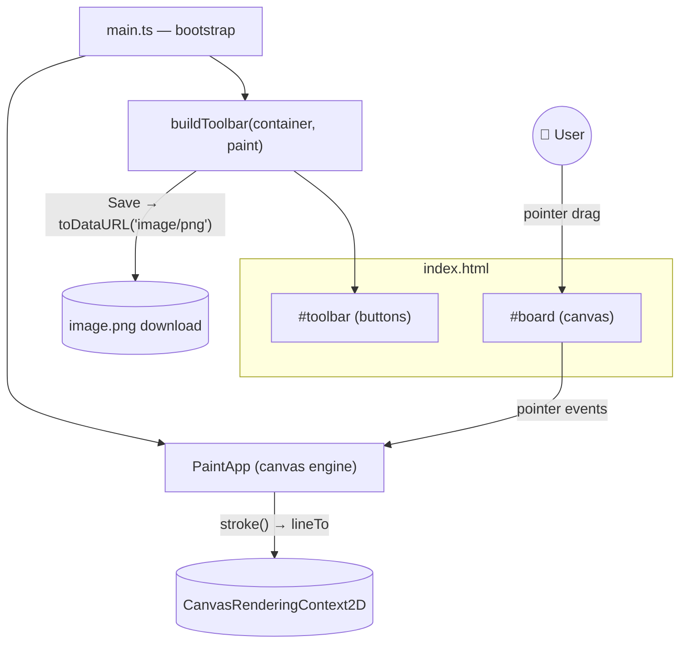
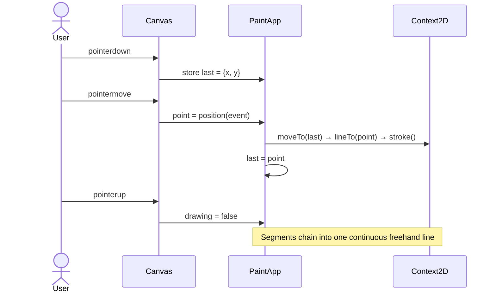
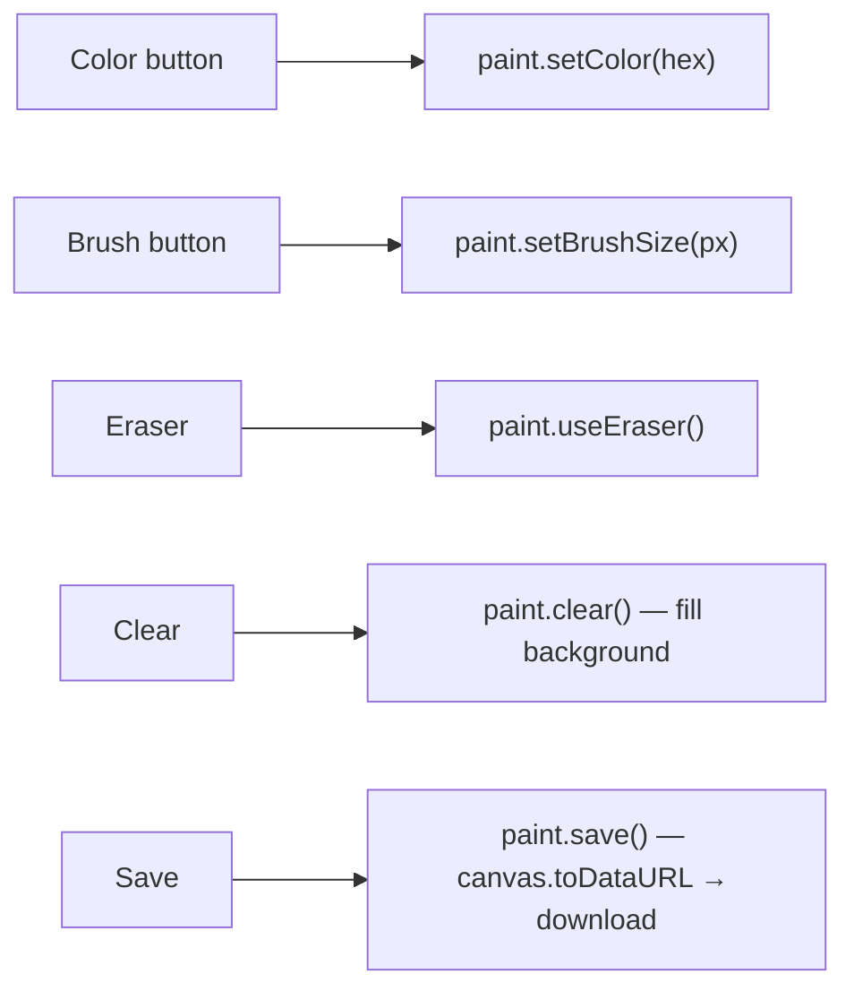

# 🎨 Windows Paint Clone

A miniature clone of **Microsoft Paint** built with **TypeScript** and the **HTML5 Canvas API**,
bundled with **Vite**. Draw freehand with the mouse (or a stylus/touch via Pointer Events), switch
colors, change brush thickness, erase, clear the canvas, and export your artwork as a PNG image.


---

## ✨ Features

- ✏️ **Freehand drawing** by pressing and dragging on the canvas
- 🎨 **Colors**: Red, Green, Blue, Black
- 🩹 **Eraser** (paints in the background color)
- 🖌️ **Brush sizes**: Small (1px), Medium (5px), Large (12px)
- 🧽 **Clear** the whole canvas
- 💾 **Save** your drawing as a downloaded `image.png`
- 🪄 Smooth, anti‑aliased strokes via rounded line caps/joins
- 🖱️ **Pointer Events** — works with mouse, touch and stylus

---

## 🏗️ Architecture

The app is split into a typed canvas engine and a toolbar builder. `PaintApp` owns the `<canvas>`
and all drawing state; `buildToolbar` generates the buttons from a config array and wires each one
to a method on the engine.



---

## 🖱️ How Drawing Works

Drawing is driven by pointer events. On **pointerdown** the engine records the starting point; on
**pointermove** it draws a line segment from the previous point to the current point; **pointerup**
ends the stroke.



### Toolbar → Engine actions



---

## 🚀 Getting Started

### Prerequisites
- **Node.js 18+** and npm (`node -v` to check)

### Install & run

```bash
# from the repository root
npm install
npm run dev       # start the Vite dev server → http://localhost:5173
```

### Build for production

```bash
npm run build     # type-check + bundle to dist/
npm run preview   # preview the production build locally
```

An 800×520 canvas opens with the toolbar above it. Pick a color/brush and start drawing. Click
**Save** to download `image.png`.

---

## 🗂️ Project Structure

```
Windows-Paint-Clone/
├── index.html           # Canvas + toolbar mount points
├── package.json         # Scripts & dev dependencies
├── tsconfig.json        # TypeScript config
├── vite.config.ts       # Vite build config
├── image.png            # Sample drawing (shown above)
└── src/
    ├── main.ts          # Bootstrap: find mounts, wire engine + toolbar
    ├── PaintApp.ts      # Canvas engine: strokes, tools, clear, save
    ├── toolbar.ts       # Builds toolbar buttons from config
    ├── types.ts         # Tool, Point, ColorSwatch, BrushPreset
    └── style.css        # Toolbar + canvas styling
```

---

## 🧰 Tech Stack

- **TypeScript** — typed canvas engine and toolbar wiring
- **HTML5 Canvas API** — the drawing surface (`CanvasRenderingContext2D`)
- **Pointer Events** — unified mouse / touch / stylus input
- **Vite** — dev server and production bundling

---

## 💡 Possible Enhancements
- Undo / redo history
- Shape tools (line, rectangle, ellipse) and adjustable canvas size
- A native color picker (`<input type="color">`) for unlimited colors
- "Save As…" with a chosen file name/location

---

> Built to explore the HTML5 Canvas API in TypeScript: pointer input, off-screen-free direct
> rendering, and exporting a canvas to PNG via `toDataURL`.
