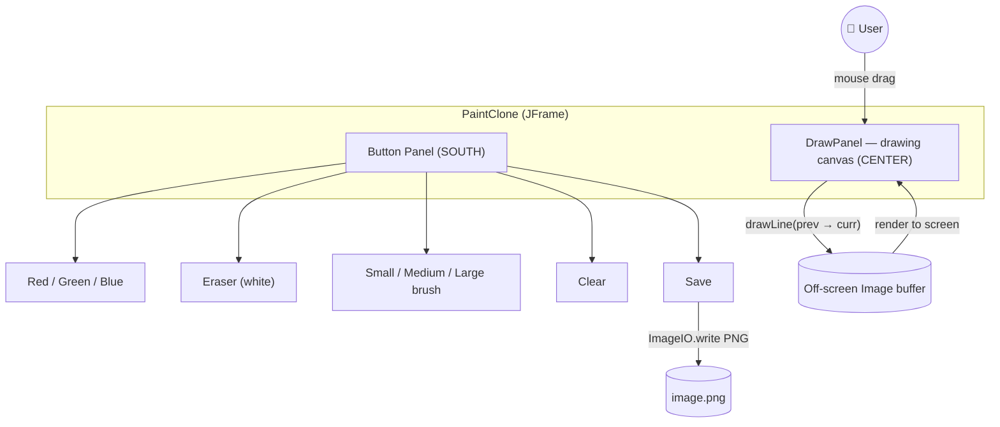
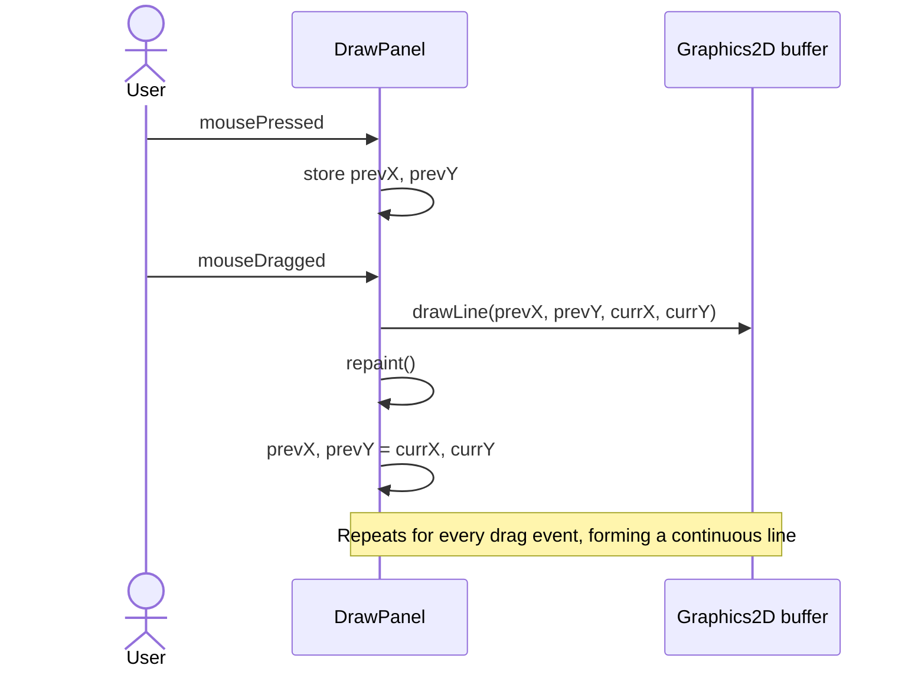
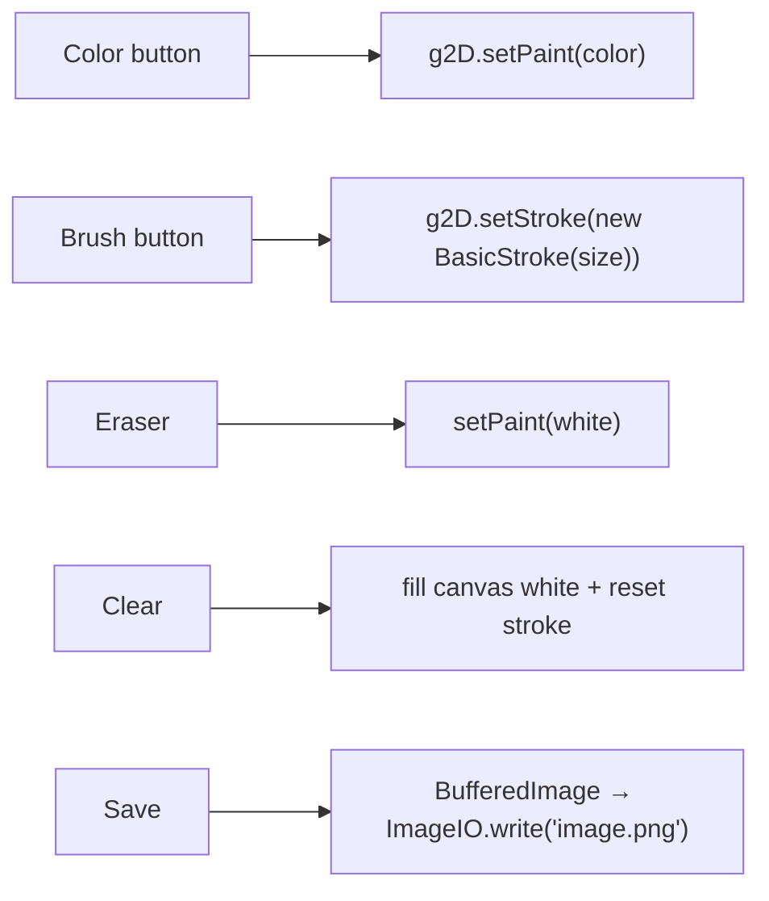

# 🎨 Windows Paint Clone

A miniature clone of **Microsoft Paint** built with **Java Swing / AWT**. Draw freehand with the
mouse, switch colors, change brush thickness, erase, clear the canvas, and export your artwork as a
PNG image.


---

## ✨ Features

- ✏️ **Freehand drawing** by clicking and dragging the mouse
- 🎨 **Colors**: Red, Green, Blue
- 🩹 **Eraser** (paints in white)
- 🖌️ **Brush sizes**: Small (1px), Medium (5px), Large (12px)
- 🧽 **Clear** the whole canvas
- 💾 **Save** your drawing to `image.png`
- 🪄 Anti‑aliased strokes for smooth lines

---

## 🏗️ Architecture

The app is composed of two classes: the `PaintClone` window (frame + toolbar of buttons) and the
`DrawPanel` canvas that captures mouse events and renders to an off‑screen image buffer.



---

## 🖱️ How Drawing Works

Drawing is driven by mouse events. On **press**, the panel records the starting point; on **drag**,
it draws a line segment from the previous point to the current point and repaints.



### Toolbar → Canvas actions



---

## 🚀 Getting Started

### Prerequisites
- **JDK 8+** (uses lambda listeners, so Java 8 or newer)

### Run it
Open in **IntelliJ IDEA** (an `.iml` file is included) and run `PaintClone.main()`, or from the
command line:

```bash
# from the repository root
javac -d out src/PaintClone.java
java -cp out PaintClone
```

A 500×460 window opens. Pick a color/brush and start drawing. Click **Save** to write `image.png`
to the working directory.

---

## 🗂️ Project Structure

```
Windows-Paint-Clone/
├── src/
│   └── PaintClone.java   # PaintClone (JFrame) + DrawPanel (canvas)
├── image.png             # Example / last saved drawing
├── .gitignore
└── Paint Clone.iml       # IntelliJ IDEA module file
```

| Class | Responsibility |
|-------|----------------|
| `PaintClone` | Builds the window, toolbar buttons, and wires up listeners |
| `DrawPanel` | Captures mouse events, draws to an off‑screen buffer, handles clear/save |

---

## 💡 Possible Enhancements
- A full color picker (`JColorChooser`) instead of three fixed colors
- Undo / redo history
- Shape tools (line, rectangle, ellipse) and adjustable canvas size
- "Save As…" dialog so the file name/location can be chosen

---

> Built to explore custom painting in Swing: mouse listeners, `Graphics2D`, off‑screen image
> buffers, and exporting a `BufferedImage` with `ImageIO`.
